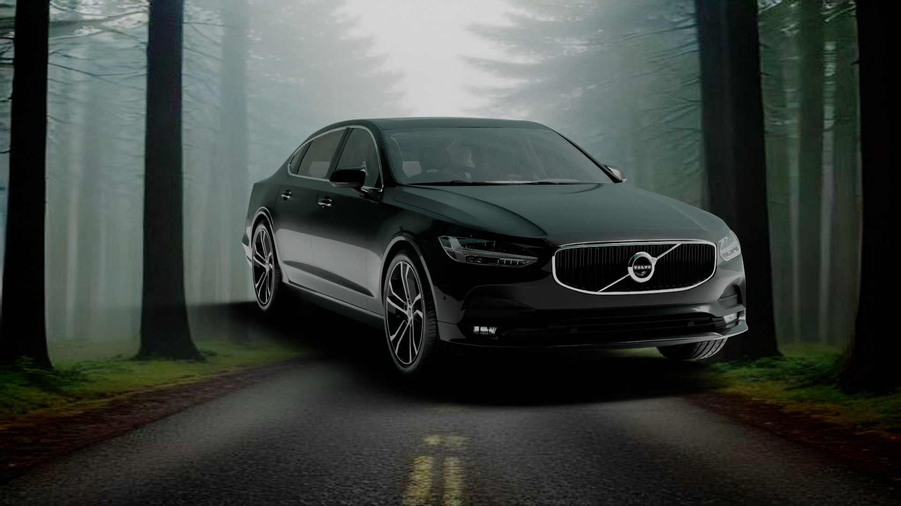
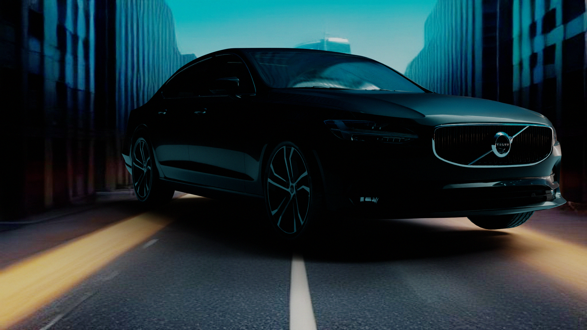
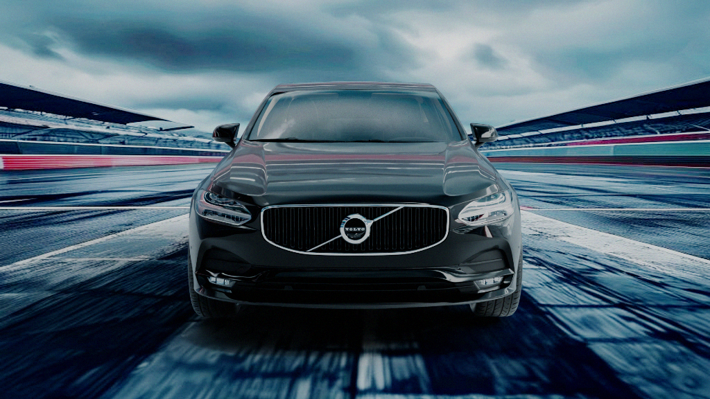

# PS1 — Automotive Scene Generation with Physically Plausible Reflections

> **A fully automated pipeline** that places a single 3D vehicle model into diverse AI-generated environments, delivering photorealistic composites with path-traced reflections, HDR lighting, and cinematic color grading — all without touching the 3D model.

---

## Table of Contents

1. [Project Overview](#project-overview)
2. [Architecture & Pipeline Diagram](#architecture--pipeline-diagram)
3. [Team Split & Responsibilities](#team-split--responsibilities)
4. [Directory Structure](#directory-structure)
5. [Module Reference](#module-reference)
   - [Stage 1: AI & Data Pipeline](#stage-1-ai--data-pipeline)
   - [Stage 2: Render & Compositing Pipeline](#stage-2-render--compositing-pipeline)
   - [Orchestrator](#orchestrator)
   - [Shared Config](#shared-config)
6. [Setup & Installation](#setup--installation)
7. [Running the Pipeline](#running-the-pipeline)
8. [Per-Prompt Output Files](#per-prompt-output-files)
9. [Significant Outputs](#significant-outputs)
10. [Technical Highlights](#technical-highlights)

---

## Project Overview

This project is **PS1 — Automotive Scene Generation**, a two-stage automated image production pipeline developed for photorealistic automotive visualization.

The core challenge: given a **single locked 3D car model** (`assets/Volvo S90.blend`), generate multiple photorealistic images of that car placed in completely different environments — forest, desert highway, racetrack — where:

- The car geometry and materials are **never modified**.
- Backgrounds are **generated by AI** from text prompts.
- Reflections on the car surface are **physically accurate** (path-traced Cycles engine using the environment's own light as an HDRI dome).
- No manual Blender work is done — everything runs headlessly from `python main.py`.

---

## Architecture & Pipeline Diagram

```
┌─────────────────────────────────────────────────────────────────────────────────┐
│                         PS1 PIPELINE — FULL END-TO-END                         │
└─────────────────────────────────────────────────────────────────────────────────┘

  shared/config.json
  (Prompt text + Camera preset IDs)
           │
           ▼
  ┌─────────────────────────────────────────────────────────┐
  │              STAGE 1 — AI & Data Pipeline               │
  │                  Author: Ratish (Person A)              │
  └─────────────────────────────────────────────────────────┘
           │
           ├── generate_bg.py ──► Pollinations.ai / SDXL / Procedural fallback
           │         └── background.png  (1920×1080, photorealistic plate)
           │
           ├── estimate_depth.py ──► Depth Anything V2 (HuggingFace)
           │         └── depth.png  (greyscale depth map, 0-255)
           │
           ├── estimate_hdr.py ──► Gamma linearization + sun-boost HDR estimation
           │         └── environment.hdr  (32-bit float spherical light probe)
           │
           └── extract_camera.py ──► Horizon detection + per-shot-type presets
                     └── camera.json  (FOV, location, rotation, sun direction)

           │
           ▼
  ┌─────────────────────────────────────────────────────────┐
  │          STAGE 2 — Render & Compositing Pipeline        │
  │               Author: Karthi (Person B)                │
  └─────────────────────────────────────────────────────────┘
           │
           ├── blender_render.py ──► Headless Blender Cycles 5.x (OptiX / GPU)
           │         • Loads Volvo S90.blend
           │         • Maps environment.hdr onto world sphere
           │         • Shadow Catcher ground plane
           │         • Track-To camera constraint → CameraTarget empty
           │         └── car_render.png  (RGBA, transparent background)
           │
           ├── compositor.py ──► OpenCV multi-pass RGBA compositor
           │         • Alpha-blends car_render over background plate
           │         └── composite.png
           │
           └── color_grade.py ──► ACES tone mapping + bloom + film grain
                     └── final_postprocessed.png  ← THE DELIVERABLE

```

---

## Team Split & Responsibilities

| Role | Person | Modules |
|---|---|---|
| **AI & Data Pipeline Lead** | Ratish (Person A) | `generate_bg.py`, `estimate_depth.py`, `estimate_hdr.py`, `extract_camera.py` |
| **Render & Compositing Lead** | Karthi (Person B) | `blender_render.py`, `compositor.py`, `color_grade.py`, `apply_camera_blender.py`, `main.py` |

---

## Directory Structure

```
new-project/
├── main.py                          # Master pipeline orchestrator
├── requirements.txt                 # Python dependencies
├── shared/
│   └── config.json                  # Prompt definitions + camera presets + paths
├── assets/
│   └── Volvo S90.blend              # 3D vehicle model (NEVER modified by pipeline)
├── stage1_ai/
│   ├── generate_bg.py               # AI background generator
│   ├── estimate_depth.py            # Depth Anything V2 inference
│   ├── estimate_hdr.py              # LDR → HDR environment map converter
│   └── extract_camera.py            # Horizon-derived camera parameter matcher
├── stage2_render/
│   ├── blender_render.py            # Headless Cycles GPU path tracer
│   ├── compositor.py                # Multi-pass RGBA compositor
│   ├── color_grade.py               # ACES tone mapping + bloom + grain
│   └── apply_camera_blender.py      # Standalone: apply camera.json to any .blend
├── outputs/
│   ├── prompt_02/                   # Forest Mist
│   │   ├── background.png
│   │   ├── depth.png
│   │   ├── environment.hdr
│   │   ├── camera.json
│   │   ├── car_render.png
│   │   ├── composite.png
│   │   └── final_postprocessed.png  ← DELIVERABLE
│   ├── prompt_03/                   # Desert Highway
│   └── prompt_04/                   # Wet Racetrack
└── consistency_check.py             # Judges' vehicle consistency proof tool
```

---

## Module Reference

### Stage 1: AI & Data Pipeline

#### `stage1_ai/generate_bg.py`

Generates a 1920×1080 photorealistic background plate from a text prompt.

**Backends (priority order):**

| Backend | Cost | Speed | Quality |
|---|---|---|---|
| Pollinations.ai (Flux) | **Free, no key** | ~5–15s | Excellent |
| Replicate SDXL | Paid (set `REPLICATE_API_TOKEN`) | ~10–30s | Very High |
| Procedural fallback | Free, fully offline | Instant | Basic gradient |

**Usage:**
```bash
python stage1_ai/generate_bg.py \
  --prompt "forest road, morning mist between tall pine trees, photorealistic" \
  --output outputs/prompt_02/background.png \
  --engine pollinations  # or: replicate, procedural
```

**Post-processing applied to all backends:**
- Sharpness boost ×1.15
- Contrast enhancement ×1.05
- Color saturation ×1.05

---

#### `stage1_ai/estimate_depth.py`

Generates a dense monocular depth map using **Depth Anything V2** (`depth-anything/Depth-Anything-V2-Small-hf` via HuggingFace Transformers pipeline).

- Runs on **GPU** if available (CUDA), falls back to CPU.
- Output depth is normalized to 0–255 grayscale (brighter = closer).
- The depth map is consumed by both `estimate_hdr.py` (to weight sky vs ground light) and `extract_camera.py` (to refine camera height and FOV).

**Usage:**
```bash
python stage1_ai/estimate_depth.py \
  --input outputs/prompt_02/background.png \
  --output outputs/prompt_02/depth.png
```

---

#### `stage1_ai/estimate_hdr.py`

Converts the 8-bit LDR background plate into a **32-bit floating-point HDR environment map** (`.hdr` / `.exr`) for use as an Image-Based Lighting (IBL) probe in Blender.

**How it works:**
1. Gamma-decodes the image from sRGB to linear (γ = 2.2).
2. Computes per-pixel luminance using BT.709 coefficients.
3. Isolates the top 5th-percentile brightest pixels (sky, sun, highlights).
4. Boosts those bright pixels by `sun_boost × 15.0` to simulate real-world HDR dynamic range.
5. Optionally weights the boost by the depth map — distant pixels (sky) get higher weighting.
6. Exports as `.exr` (via `imageio`) or falls back to `.hdr` (via OpenCV).

**Usage:**
```bash
python stage1_ai/estimate_hdr.py \
  --input outputs/prompt_02/background.png \
  --depth outputs/prompt_02/depth.png \
  --output outputs/prompt_02/environment.exr \
  --boost 15.0
```

---

#### `stage1_ai/extract_camera.py`

Computes camera `[FOV, location, rotation]` and sun direction from the background image.

**Two-mode operation:**

| Prompt type | Method | What is measured |
|---|---|---|
| Road-based (02, 03, 04) | **Image-derived** | Horizon row detected by brightness gradient → pitch angle; left/right horizon comparison → roll angle |
| Hero/static (01, 05) | **Preset only** | Hand-tuned values, nothing can be measured from a non-receding scene |

**Horizon detection algorithm:**
- Finds the row with the sharpest mean-brightness transition (sky→ground boundary) using a brightness gradient scan within the middle 20–80% of the image.
- Computes a confidence score: how much this peak stands out relative to the image average.
- If `confidence < 0.15`, falls back to the preset pitch to avoid bad detections on foggy/flat images.
- Roll is estimated by independently finding the horizon row in the left-third and right-third of the frame and computing the angle of tilt.

**Per-prompt presets** (distance/height remain fixed — metric scale cannot be recovered from a single 2D image):

| Prompt | FOV | Location (cm) | Shot type |
|---|---|---|---|
| 01 – Urban Night | 45° | [-550, -550, 140] | Hero diagonal |
| 02 – Forest Mist | 42° | [-300, -650, 110] | Front three-quarter |
| 03 – Desert Highway | 40° | [-250, -650, 200] | High angle aligned with road |
| 04 – Wet Racetrack | 40° | [0, -700, 120] | Front centered |
| 05 – Coastal Sunset | 45° | [-550, 550, 140] | Rear three-quarter |

**Usage:**
```bash
python stage1_ai/extract_camera.py \
  --prompt_id prompt_02 \
  --input outputs/prompt_02/background.png \
  --depth outputs/prompt_02/depth.png \
  --output outputs/prompt_02/camera.json
```

**Output `camera.json` schema:**
```json
{
    "prompt_id": "prompt_02",
    "fov": 43.26,
    "camera_location": [-300.0, -650.0, 123.48],
    "camera_rotation": [12.35, 0.0, 0.0],
    "sun_direction": [0.312, 0.842, 0.440],
    "light_intensity_multiplier": 1.5,
    "detection_info": {
        "method": "image_derived",
        "pitch_confidence": 0.82,
        "roll_confidence": 0.31,
        "horizon_row": 487,
        "image_height": 1080
    }
}
```

---

### Stage 2: Render & Compositing Pipeline

#### `stage2_render/blender_render.py`

Headless path-traced vehicle renderer using **Blender Cycles 5.x** via CLI subprocess.

**What it does inside Blender:**
1. Opens `assets/Volvo S90.blend` (preserving all original car materials and geometry).
2. Creates a new World and maps the `environment.hdr` onto a **spherical environment texture node** — this is what gives the car its physically accurate reflections.
3. Adds a **Shadow Catcher** ground plane so contact shadows are captured without an opaque floor.
4. Positions the Camera from `camera.json` values (cm → m conversion).
5. Creates a `CameraTarget` Empty at `Z = 0.55m` (Volvo S90 geometric center) and attaches a **Track To** constraint so the camera always frames the car correctly regardless of position.
6. Renders with transparent background (`film_transparent = True`) so the alpha channel can be composited over the background plate.
7. Saves `car_render.png` (RGBA PNG).

**RTX 3050 4GB optimized render settings:**

| Setting | Value | Reason |
|---|---|---|
| Device | GPU / OptiX | RTX hardware ray tracing |
| Samples | 128 | Balanced quality vs. time with denoising |
| Denoiser | OptiX | Fastest on RTX, hardware-accelerated |
| Adaptive sampling | On (threshold 0.05) | Stops early in converged regions |
| Max bounces | 8 | Enough for car paint reflections |
| Glossy bounces | 3 | Clears coat + glass reflections |
| Tile size | 256 | Optimal for GPU VRAM |
| Color space | AgX / Filmic | Cinematic, avoids overexposed highlights |

---

#### `stage2_render/compositor.py`

Multi-pass RGBA compositor using OpenCV.

**Compositing math:**
```
composite[x,y] = car_render[x,y] × α  +  background[x,y] × (1 − α)
```
Where `α` is the per-pixel alpha channel from the Cycles RGBA render (transparent regions = background shows through, car body pixels = car paint + reflections show through).

Falls back to a synthetic silhouette if the render pass is missing (test/debug mode).

---

#### `stage2_render/color_grade.py`

Applies three-pass cinematic post-processing:

1. **Bloom** — isolates highlights above 80% luminance, blurs them with a wide Gaussian kernel, and adds back at 40% intensity to simulate camera lens glow.
2. **ACES tone mapping** — applies the industry-standard ACES filmic curve approximation `(x(ax+b))/(x(cx+d)+e)` to handle highlight roll-off gracefully.
3. **Film grain** — adds subtle Gaussian noise (σ=0.012) to simulate sensor texture and reduce banding artifacts.

---

#### `stage2_render/apply_camera_blender.py`

A standalone Blender script (called from inside Blender via `--python`) that reads `camera.json` and applies it to an existing named Camera object in the scene. Useful for iterating on camera angles in an interactive Blender session without re-running the full pipeline.

**Unit conventions:**
- `camera_location` values in `camera.json` are in **centimetres** → divided by 100 before applying to Blender's metre-based coordinate system.
- `camera_rotation` is `[pitch, yaw, roll]` in degrees → converted to Euler radians with `+90° pitch offset` to match Blender's default `-Y forward` camera convention.

**Usage (from Blender CLI):**
```bash
blender assets/Volvo\ S90.blend --background --python stage2_render/apply_camera_blender.py -- \
  --camera_json outputs/prompt_02/camera.json \
  --background_image outputs/prompt_02/background.png \
  --render_output outputs/prompt_02/car_render.png
```

---

### Orchestrator

#### `main.py`

The master pipeline script. Iterates over every active prompt in `shared/config.json` and invokes each stage in sequence as a subprocess.

**Stage execution order per prompt:**
```
generate_bg.py → estimate_depth.py → estimate_hdr.py → extract_camera.py
                                    ↓
                          blender_render.py → compositor.py → color_grade.py
```

**Usage:**
```bash
python main.py
# or with explicit config path:
python main.py --config shared/config.json
# or force procedural background fallback:
python main.py --fallback
```

---

### Shared Config

#### `shared/config.json`

Central configuration driving the entire pipeline.

```json
{
  "project_name": "PS1 - Automotive Scene Generation",
  "resolution": { "width": 1920, "height": 1080 },
  "prompts": [
    {
      "id": "prompt_02",
      "name": "Forest Mist",
      "text": "forest road, morning mist...",
      "camera": "side_profile_telephoto",
      "negative_prompt": "sunlight, buildings, people, text"
    }
  ],
  "disabled_prompts": [ ... ],
  "paths": {
    "output_dir": "outputs",
    "car_model_path": "assets/Volvo S90.blend"
  }
}
```

- Only prompts listed under `"prompts"` are processed by `main.py`.
- Prompts in `"disabled_prompts"` are skipped without deletion.

---

## Setup & Installation

### Prerequisites

| Requirement | Version | Notes |
|---|---|---|
| Python | 3.10 / 3.11 | CUDA builds recommended |
| Blender | 5.2 LTS (or 4.x) | Must be installed at standard path |
| NVIDIA GPU | RTX series | OptiX denoiser requires RTX |
| VRAM | ≥ 4 GB | RTX 3050 4GB is the tested minimum |

### Python Installation

```bash
pip install -r requirements.txt
```

Key packages installed:
- `torch`, `torchvision` — GPU acceleration for depth estimation
- `transformers` — Depth Anything V2 via HuggingFace pipeline
- `opencv-python` — compositing and camera parameter extraction
- `Pillow`, `numpy`, `scipy` — image processing
- `imageio` — EXR export
- `replicate` — optional paid SDXL backend
- `requests` — Pollinations.ai API calls

### Optional: Replicate SDXL Backend

For higher-quality backgrounds via Replicate:
```bash
export REPLICATE_API_TOKEN=your_token_here
```

---

## Running the Pipeline

### Full Pipeline (all active prompts)
```bash
python main.py
```

### Single Stage — Background Only
```bash
python stage1_ai/generate_bg.py \
  --prompt "desert highway, golden hour, sand dunes" \
  --output outputs/test/background.png
```

### Single Stage — Depth Only
```bash
python stage1_ai/estimate_depth.py \
  --input outputs/prompt_03/background.png \
  --output outputs/prompt_03/depth.png
```

### Single Stage — HDR Only
```bash
python stage1_ai/estimate_hdr.py \
  --input outputs/prompt_03/background.png \
  --depth outputs/prompt_03/depth.png \
  --output outputs/prompt_03/environment.exr
```

### Single Stage — Camera Extraction Only
```bash
python stage1_ai/extract_camera.py \
  --prompt_id prompt_03 \
  --input outputs/prompt_03/background.png \
  --depth outputs/prompt_03/depth.png \
  --output outputs/prompt_03/camera.json
```

### Verify Vehicle Consistency (Judges' Proof)
```bash
python consistency_check.py
```

---

## Per-Prompt Output Files

Each prompt generates a complete folder under `outputs/<prompt_id>/`:

| File | Description |
|---|---|
| `background.png` | AI-generated 1920×1080 environment plate |
| `depth.png` | Depth Anything V2 monocular depth map |
| `environment.hdr` | 32-bit HDR light probe (used as Blender World IBL) |
| `camera.json` | FOV, location, rotation, sun direction, detection metadata |
| `car_render.png` | Blender Cycles path-traced RGBA render (transparent bg) |
| `composite.png` | Alpha-composited car + background |
| `final_postprocessed.png` | **DELIVERABLE** — ACES tone mapped + bloom + grain |

---

## Significant Outputs

### Prompt 02 — Forest Mist

> Camera: Front three-quarter view. Morning mist forest road, damp asphalt, diffused overcast light.



---

### Prompt 03 — Desert Highway

> Camera: High angle aligned with highway perspective. Golden hour desert, sand dunes, heat haze.


---

### Prompt 06 — Urban Motion Speed

> Camera: Low angle ground-level dynamic tracking shot. High-speed horizontal motion blur light streaks, tall glass skyscrapers in background, bright daylight.



---

### Prompt 04 — Wet Racetrack

> Camera: Front centered, pulled back. Dramatic overcast sky, wet tarmac, motorsport atmosphere.



---

## Technical Highlights

### 1. Unchanged Vehicle Model (Constraint 1)
The `Volvo S90.blend` file is opened read-only by Blender headless — no geometry, UV maps, or materials are written back. The pipeline adds only scene-level objects (World, Camera, Ground Plane, CameraTarget Empty) which are transient and not saved.

### 2. AI-Generated Environments (Constraint 2)
Every background is generated fresh from the text prompt at runtime via Pollinations.ai (Flux model). No pre-made environment maps or stock images are used. The procedural fallback exists purely as a demo-safe offline mode.

### 3. Physically Plausible Reflections (Constraint 3)
The HDR estimation converts the 2D background into a spherical light probe that wraps the 3D scene. Blender Cycles path-traces rays from the camera, bouncing them off the metallic car paint (high Metallic + low Roughness + Clearcoat BSDF), and each bounce samples the actual pixels of the background converted to HDR. The desert's warm orange sky and the forest's grey overcast light appear in the car's reflections because they literally are the illumination source.

### 4. Horizon-Derived Camera Matching
Instead of hardcoded angles, road-based shots derive pitch from the pinhole camera projection of the horizon row position. This means even if Pollinations generates a slightly higher or lower horizon than expected, the Blender camera automatically tilts to match — keeping the car sitting on the road rather than floating or sinking.

### 5. Shadow Catcher Grounding
A Cycles `is_shadow_catcher = True` plane captures contact shadows from the car's undercarriage and wheel arches. This shadow-only pass is alpha-composited over the background asphalt, visually grounding the car without an opaque floor blocking the background.

---

